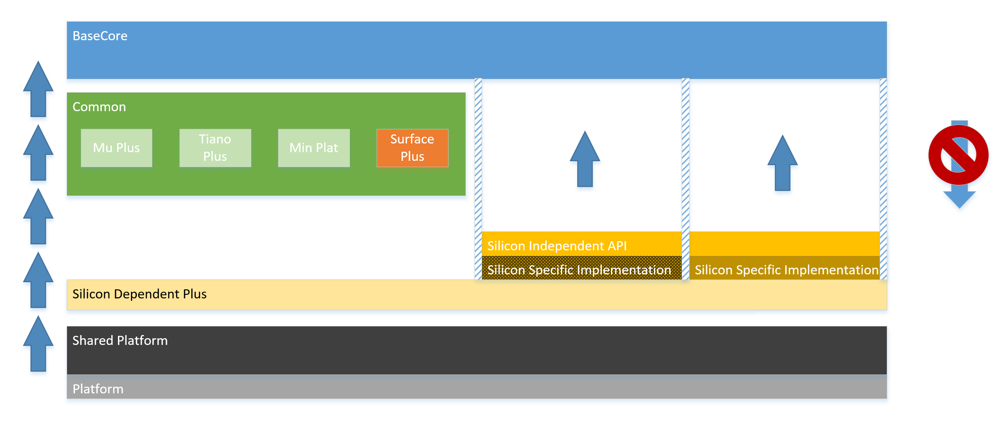

# Dependencies and Layout

## Conceptual Layers

A modern, full-featured, product-ready UEFI firmware codebase combines code from a multitude of sources:

* TianoCore EDK2 UEFI standard-based code
* Value-add code from TianoCore
* Silicon vendor hardware initialization code
* Silicon vendor value-add code
* Independent BIOS Vendor code
* ODM/OEM customization code
* OS firmware support code
* Legacy BIOS compatibility code
* Board-specific code
* etc.

Some of the above components come from closed-source projects (silicon vendors, IBVs, OEMs), others are open source.  Each component is supported at its own schedule with new features and bugfixes, creating a problem of stale code if not synced up regularly. Compound the version and source problem with the sheer size: a common UEFI codebase is typically well above 1 million LOC and only goes up from there.  

## What is a dependency

To understand the layering you must first understand the terminology.  There are two types of code assets.  

  1. A definition of something.  Generally, this is defined in an accessible header file.  This is the API provided by some asset.  This API can be "depended" upon to provide some capability.
  2. An implementation of something.

<center></center>

Example of a dependency: DxeCore in the Basecore layer includes a TimerLib interface.  TimerLib interface is defined in the same Basecore layer as DxeCore, so in this case a Basecore module is depending on a Basecore interface. This is allowed.

Another example: Silicon-layer module implements a TimerLib interface defined in Basecore.  Here, a Silicon layer module depends on a Basecore interface. This is allowed.

## Architecture

Project Mu is an attempt to create a rigid layering scheme that defines the hierarchy of dependencies.  Architectural goal kept in mind when designing this layering scheme is a controlled, limited scope, and allowed dependecies for each module within a given layer.  It is important to know, when implementing a module, what the module is allowed to depend on. When creating an interface, it is important to identify the correct layer for it such that all the consuming modules are located in the layers below.

Motivation and goals of the layering scheme:

* Easy component integration
* Code reuse
* Only carry relevant code

## Dependency Block Diagram



## File Layout

To best preserve and delineate these concepts of componentization and unidirectional dependency, we have chosen to lay out our repository files in a structure that reinforces the same mentality.

The underlying logic of this layout is to clearly distinguish each layer from the rest. As such, the Basecore -- which is considered foundational -- is broken out on its own, followed by the Common repos, followed by the Silicon, followed by the Platform. As mentioned elsewhere, Project Mu makes liberal use of multiple repositories due to the mixture of requirements in the firmware ecosystem. Some repos are split for technical reasons, some for organizational, and some for legal. One of the goals of Project Mu is to make this seemingly complicated layout easier to work with.

### Min Platform Example

A simple tree might look like this...

```
project_mu/
├── Build/
├── Common/
│   └── ...                     # Common code optional, but probably not required
├── Conf/
├── MU_BASECORE/
├── Platform/
│   └── Sample/
│       └── MyMinPlatform       # Platform-specific build files and code
├── Silicon/
│   └── SiProvider/
│       └── REF_CODE/           # Enablement code for your architecture
├── .gitattributes
├── .gitignore
├── .gitmodules
└── bootstrap_repo.py
```

Note that this file structure is likely located in a Git repository, and every "ALL CAPS" directory in this example is a Git submodule/nested repository.

### Surface Laptop Example

For a real-world example, this is a tree that could build the Surface Laptop product, including both open- and closed-source repositories:

```
project_mu/
├── Build/
├── Common/
│   ├── MSCORE_INTERNAL/        # Proprietary code and code not yet approved for public distribution
│   ├── MU/
│   ├── MU_TIANO/
│   └── SURFACE/                # Shared code to enable common features like FrontPage
├── Conf/
├── MU_BASECORE/
├── Platform/
│   ├── Surface/
│   │   ├── SurfKbl/
│   │   │   └── Laptop/         # Surface Laptop-Specific Platform Code
│   │   └── ...
│   └── Others/
│       └── ...
├── Silicon/
│   ├── Intel/
│   │   ├── KBL/                # Intel KBL Reference Code
│   │   ├── MU/                 # Project Mu Intel Common Code
│   │   ├── MU_TIANO/           # Project Mu Intel Code from TianoCore
│   │   └── SURF_KBL/           # Surface Customizations/Overrides for KBL Ref Code
│   └── SURFACE/                # Shared code to enable common HW like ECs
├── .gitattributes
├── .gitignore
├── .gitmodules
└── bootstrap_repo.py
```

Once again, the "ALL CAPS" directories are submodules.
